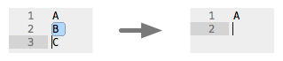
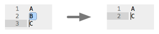

Delete Lines (Sublime Text plugin)
===============

Delete Lines is a [Sublime Text](http://www.sublimetext.com/) plugin that adds a new command ```delete_lines``` simulating the Delete Line [Eclipse](http://eclipse.org) key command.

Sublime Text has a built-in macro called ```Delete Line.sublime-macro``` (```ctrl + shift + k```), but it works slightly different from the Eclipse' Delete Line when the selection includes the last line break.

Assuming there are three lines in the buffer and I am going to delete the second line.

Here is what the macro does.



Note that the third line is also deleted because the selection includes the line break on the second line.  
This might be the right behavior, but not the expected behavior.

This plugin's ```delete_lines``` command deletes only the second line with the same selection.



The attached key bindings are ```ctrl + shift + k``` on all platforms.
```
{ "keys": ["ctrl+shift+k"], "command": "delete_lines" }
```

## Installation

### Using Package Control

If you already installed [Package Control](https://sublime.wbond.net/installation)...

1. Press ```cmd + shift + p``` (OS X) or ```ctrl + shift + p``` (Win, Linux) to open Command Pallette.
1. Type ```package``` and select ```Package Control: Install Package``` from the list.
1. Search ```Delete Lines``` and install it.

### Manual Installation

1. On GitHub, press ```Download Zip``` button to download this repository as an archive.
1. Choose ```Browse Packages...``` from the menu of Sublime Text to open Packages directory.
1. Unarchive the downloaded zip in the Packages directory.
1. Restart Sublime Text.

## License

Delete Lines plugin is licensed under [MIT License](http://www.opensource.org/licenses/mit-license.php).
